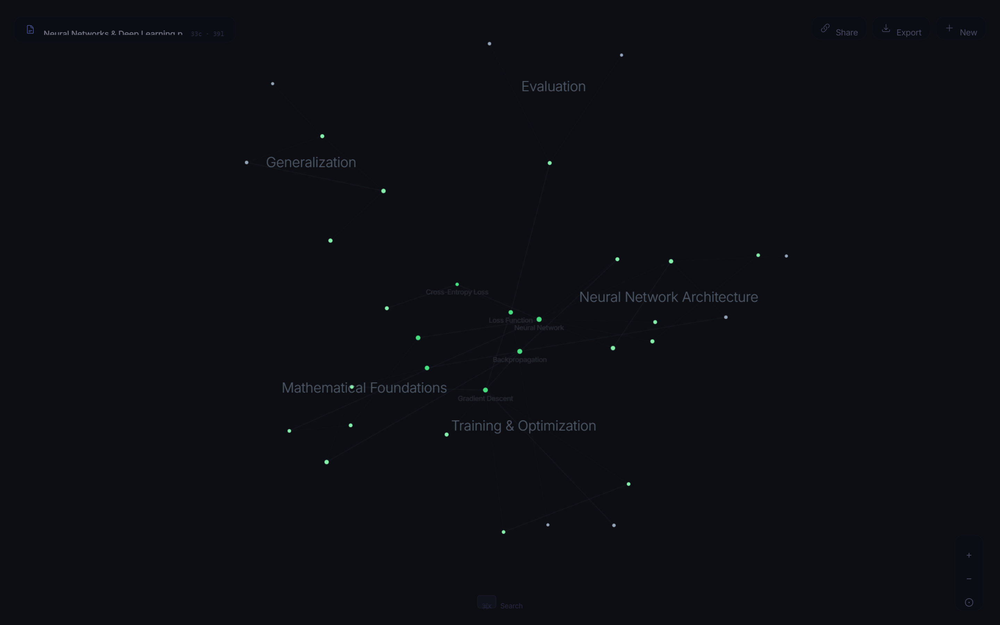
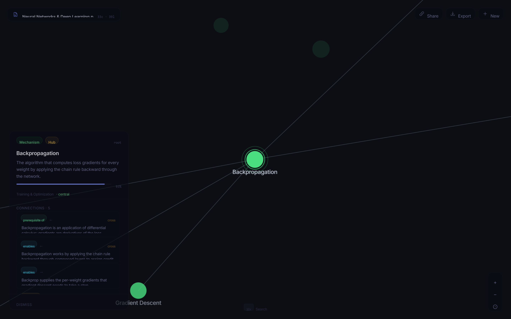
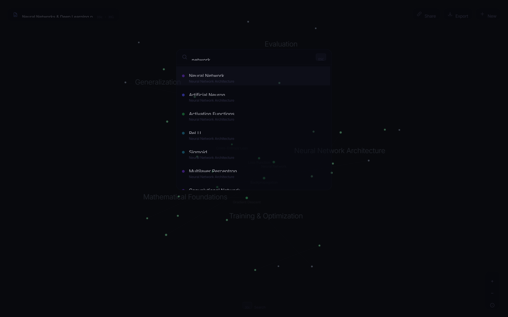

<div align="center">

# Knowledge Mapper

**Turn a dense PDF into an interactive map of how its ideas connect.**

Upload educational material and get a force-directed graph of the concepts inside it — and the prerequisite, causal, and dependency links between them, inferred by an LLM rather than keyword matching.


<br/>



<sub>A 30-page "Neural Networks & Deep Learning" PDF, mapped into five concept domains. Foundational hubs anchor the center; each domain fans out into its own arm.</sub>

</div>

---

## The Problem

"Chat with your PDF" tools answer questions in sequence. They're great at retrieval and blind to structure — they never show you how the ideas in a document fit together. When you're learning a technical subject, the thing you actually need is the *shape* of it: what's foundational, what depends on what, what causes what. That structure is implicit in the text and invisible in a chat window.

## The Solution

Knowledge Mapper reads a document the way a course designer would, in three passes, then renders the result as a living graph you can explore.

1. **Global understanding** — one LLM pass builds a model of what the document teaches: a summary, its themes, its conceptual domains, the root concepts, and the intended learning flow.
2. **Hierarchical concept extraction** — the text is chunked and processed concurrently; the LLM pulls out teachable concepts (each typed, scored for importance, tagged with its parent and prerequisites), which deterministic code then assembles into an acyclic hierarchy.
3. **Topology inference** — a heuristic scorer ranks concept pairs by cross-domain reach, hierarchy distance, importance, and type complementarity, and sends only the strongest candidates to the LLM in small batches. The model returns directed, typed relationships, each with a one-line mechanistic justification.

---

## A closer look

<table>
<tr>
<td width="50%" valign="top">



**Click any concept** to focus it. The graph dims to its neighborhood and a panel shows the concept, its importance, and every relationship — with the model's reasoning for each link ("*Backpropagation is an application of differential calculus; gradients are derivatives of the loss*").

</td>
<td width="50%" valign="top">



**⌘K** opens a command palette to jump to any concept by name or domain. Pan, zoom, and fit controls live on the canvas; the whole map is keyboard-navigable.

</td>
</tr>
</table>

---

## Features

| | |
|---|---|
| **Three-stage LLM pipeline** | Global understanding → hierarchical extraction → relationship inference, with deterministic scaffolding (dedup, ID resolution, cycle-breaking, edge-capping) around every model call so output is structured, not hallucinated soup. |
| **12 typed relationships** | `prerequisite_of`, `causes`, `depends_on`, `enables`, `specializes`, `derived_from`, and more — each directed and carrying the model's reasoning. |
| **From-scratch canvas renderer** | A custom 2D engine with a force-directed simulation, spatial-hash hit testing, momentum panning, and a cooldown that lets the layout settle and idle near 0% CPU. No graph library. |
| **Live progress streaming** | Server-Sent Events report each stage (understanding, chunk *N/M*, topology batch *N/M*) as it happens. |
| **Persistent & shareable** | Every processed graph is saved to SQLite, survives a refresh, and gets a `?doc=<id>` link you can share or revisit without re-running the pipeline. |
| **Markdown export** | Download the map as a single Markdown file with Obsidian-style `[[wikilinks]]`, ready to drop into a vault. |
| **Polished details** | Real loading / empty / error states, `prefers-reduced-motion` support, and a keyboard-first interface. |

---

## How it works

```
┌──────────────┐     ┌─────────────────────────────────────────────────┐     ┌──────────────┐
│   INGESTION  │     │                LLM PIPELINE (async)              │     │   GRAPH UI   │
│              │     │                                                  │     │              │
│ • PDF upload │ ──► │ 1. Global understanding    (1 LLM call)          │ ──► │ • Canvas 2D  │
│ • PyMuPDF    │     │ 2. Concept extraction      (chunked, concurrent) │     │ • Force sim  │
│ • Text clean │     │    + hierarchy assembly    (dedup, acyclic)      │     │ • SSE stream │
│              │     │ 3. Topology inference      (scored, batched)     │     │ • Focus/⌘K   │
│              │     │    + hub detection + galaxy seed layout          │     │ • MD export  │
└──────────────┘     └─────────────────────────────────────────────────┘     └──────────────┘
        │                                  │                                         │
        └──────────────── SQLite persistence  (shareable  ?doc=<id>) ───────────────┘
```

**Why scored candidate pairs.** Checking every concept pair for a relationship is *O(N²)* — 30 concepts is 435 pairs, and each pair is an LLM call's worth of reasoning. Instead of sending them all, the backend scores pairs (cross-domain links and links *across* hierarchy branches are the interesting ones) and sends only the top `MAX_CANDIDATE_PAIRS` (default 150) in batches of 8. That keeps latency and API cost bounded as documents grow, and biases the graph toward the non-obvious connections worth surfacing.

**Where the LLM stops and code starts.** The model is asked only to *judge* — extract concepts, classify relationships. Everything structural is deterministic Python: deduplicating concepts across overlapping chunks, resolving free-text parent/prerequisite labels into IDs, breaking cycles to keep the hierarchy acyclic, capping edges per node so hubs don't hairball, and computing the initial "galaxy" layout. This is what keeps the output trustworthy instead of a pile of plausible-sounding links.

---

## Tech Stack

- **Frontend** — Next.js 15 (App Router) · React 19 · TypeScript · Tailwind CSS · a hand-written `<canvas>` renderer with a custom force simulation (`PhysicsEngine.ts`) and spatial hash (`SpatialIndex.ts`).
- **Backend** — FastAPI · Uvicorn · `sse-starlette` for streaming · SQLite (stdlib) for persistence.
- **Ingestion** — PyMuPDF for PDF text extraction.
- **LLM** — DeepSeek API via the OpenAI SDK (any OpenAI-compatible endpoint works).

> No Cytoscape, no charting library, no global-state library, no embeddings, no NLTK/tf-idf, no community-detection package. Concept and relationship discovery is done entirely by the LLM; everything else is hand-written.

---

## Quick Start

**Prerequisites:** Node.js 18+, Python 3.11+. A DeepSeek API key (free tier works, or any OpenAI-compatible provider) is **optional** — the bundled example graphs explore with no key; a key is only needed to process your own PDF.

**1. Backend**

```bash
cd backend
python -m venv .venv
# Windows:  .venv\Scripts\activate
# macOS/Linux:  source .venv/bin/activate

pip install -r requirements.txt
cp .env.example .env          # optional: set DEEPSEEK_API_KEY to enable uploads
uvicorn app.main:app --reload --port 8000
```

**2. Frontend**

```bash
cd frontend
npm install
npm run dev
```

Open **[http://localhost:3000](http://localhost:3000)**. Explore a bundled example instantly, or drop in a PDF (with a key set, or paste your own in the UI).

> **Regenerate the examples** (needs a key): `cd backend && python scripts/generate_examples.py` rebuilds `app/examples/*.json` from the source texts in that script.

---

## Deploy — Vercel (frontend) + Railway (backend)

The Next.js frontend deploys to **Vercel**, the FastAPI backend to **Railway**.

**1. Backend → Railway**

- New project → *Deploy from GitHub repo* → set **Root Directory** to `backend`.
- Railway installs `requirements.txt` and runs the [`Procfile`](backend/Procfile)
  (`uvicorn app.main:app --host 0.0.0.0 --port $PORT`).
- Environment variables (see [`backend/.env.example`](backend/.env.example)):
  - `CORS_ORIGINS=https://your-frontend.vercel.app` — **required** so the frontend can call the backend.
  - `DEEPSEEK_API_KEY` — *optional*. Set it to let anyone upload PDFs using your key; leave it unset and visitors bring their own key. Either way the bundled examples work.
  - *(Optional)* Mount a Railway volume and set `DB_PATH` / `UPLOAD_DIR` to persist user-uploaded graphs. Examples re-seed on every boot regardless.
- Copy the public URL, e.g. `https://knowledge-mapper.up.railway.app`.

**2. Frontend → Vercel**

- New project → import this repo → set **Root Directory** to `frontend` (Vercel auto-detects Next.js).
- Set environment variable `NEXT_PUBLIC_API_URL=https://your-railway-backend.up.railway.app` (baked in at build time; see [`frontend/.env.example`](frontend/.env.example)).
- Deploy. The landing page shows the example gallery instantly; uploads use the server key if set, or a visitor-supplied key.

---

## Architecture

```text
knowledge-mapper/
├── backend/
│   ├── app/
│   │   ├── main.py                  # FastAPI app, CORS, lifespan
│   │   ├── config.py                # env-driven settings + tuning knobs
│   │   ├── database.py              # SQLite persistence (graph payloads)
│   │   ├── examples_seed.py         # seed bundled example graphs on startup
│   │   ├── examples/                # precomputed example graph payloads (*.json)
│   │   ├── api/
│   │   │   ├── upload.py            # /upload (+ X-API-Key) + pipeline orchestration
│   │   │   ├── stream.py            # /stream/{job_id} SSE progress
│   │   │   └── documents.py         # /document/{id}, /documents, /examples
│   │   └── services/                # one module per pipeline stage
│   │       ├── text_extractor.py    #   PyMuPDF extraction
│   │       ├── text_cleaner.py      #   artifact / normalization cleanup
│   │       ├── global_understanding.py
│   │       ├── concept_extractor.py
│   │       ├── hierarchy_assembly.py
│   │       ├── topology_inference.py
│   │       ├── graph_transformer.py #   galaxy layout + graph payload
│   │       └── deepseek_client.py
│   ├── scripts/generate_examples.py # regenerate the bundled examples (needs a key)
│   ├── Procfile                     # Railway start command
│   └── requirements.txt
├── frontend/
│   ├── app/                         # App Router pages + global styles
│   ├── components/
│   │   ├── canvas/                  # KnowledgeCanvas, PhysicsEngine, SpatialIndex
│   │   ├── panels/                  # Upload, Concept, Search
│   │   └── hud/                     # on-canvas controls
│   └── lib/                         # api client + Markdown export
└── README.md
```

---

## Limitations

- **Uploads need an API key.** Concept and relationship discovery is LLM-driven, so mapping *your own* PDF requires a key (the server's or your own, pasted in the UI). The bundled example graphs are precomputed and need no key.
- **Cost and latency scale with concepts.** A short PDF maps in ~10–30s; large documents (50+ pages) take longer as more chunks and relationship batches go to the LLM. Hard caps (pages, chunks, concepts, pairs, edges) keep this bounded and are configurable in `config.py`.
- **Text PDFs only.** Scanned or image-only PDFs yield no text and are rejected; there's no OCR.
- **Single document.** Each upload is mapped independently — there's no cross-document merge.
- **STEM-leaning.** The prompts are tuned for material with real prerequisite structure; loosely-structured humanities texts produce sparser maps.
- **Single-process state.** In-flight jobs live in memory (finished graphs are persisted); horizontal scaling would need a shared store like Redis.

---

## A note on building this

The hard part wasn't calling the model — it was making the model's output *structural and trustworthy*. Most of the backend is the deterministic scaffolding around the LLM described above; without it, you get a pile of plausible links that don't form a coherent hierarchy. The other piece I'm happy with is the renderer: a from-scratch canvas force simulation with an alpha cooldown, so a 200-node graph animates into place and then comes fully to rest instead of pinning a core forever. Built with AI assistance on the implementation; the pipeline design, the structural-validation approach, and the rendering decisions are the parts worth pointing at.

<sub>Screenshots above use a sample "Neural Networks & Deep Learning" map.</sub>

## License

MIT — see [LICENSE](LICENSE).
